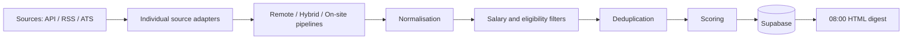

# Job Scout

Unattended global job discovery for a mechanical / water-infrastructure engineer. Three pipelines (remote, hybrid, on-site) run on GitHub Actions, persist to Supabase, and send one HTML email at 08:00 Africa/Johannesburg.

The desktop does not need to be on.

## 1. What it does

- Searches approved free APIs, RSS feeds and public ATS boards.
- Normalises every listing into one job model.
- Applies hard geographic and salary gates **before** scoring.
- Deduplicates across platforms into one canonical job with many source URLs.
- Scores 0–100 with written reasons (no paid LLM).
- Emails Exceptional / Strong / Good matches once; repeats only if the listing materially changed.

## 2. Architecture

Python package lives at `src/job_scout/` (importable as `job_scout`) rather than a pile of top-level `src/adapters` modules. Behaviour matches the planned layout.



Adapters never score, dedupe, email, or write SQL. One broken source is logged and skipped.

## 3. Local installation

Python **3.12** is required. On this Windows machine it is installed at:

`C:\Users\delanget\AppData\Local\Programs\Python\Python312\python.exe`

It is **not** on PATH until you add it.

```powershell
cd "C:\Users\delanget\OneDrive\04 Ventures\Career Python Scraper"
py -3.12 -m venv .venv
.\.venv\Scripts\Activate.ps1
python -m pip install -e ".[dev]"
copy .env.example .env
pytest
```

Playwright is **not** a default dependency. Install `pip install -e ".[browser]"` only for a future adapter that cannot use HTTP.

## 4. Supabase setup

See [docs/SUPABASE_SETUP.md](docs/SUPABASE_SETUP.md). Run `supabase/migrations/0001_init.sql` in the SQL editor. Tests never write to production.

## 5. GitHub repository setup

1. Create a private GitHub repository and push this project.
2. Add the secrets in [docs/GITHUB_SECRETS.md](docs/GITHUB_SECRETS.md).
3. Confirm Actions can run on the default branch (schedules only fire there).
4. Run **scrape**, **digest** and **health** once via `workflow_dispatch`.

## 6. Required GitHub Secrets

At minimum: `SUPABASE_URL`, `SUPABASE_SERVICE_ROLE_KEY`. For email: `SMTP_HOST`, `SMTP_PORT`, `SMTP_USERNAME`, `SMTP_PASSWORD`, `SMTP_FROM`, `SMTP_TO`. Optional: USAJOBS and Adzuna keys.

## 7. How to add another ATS / employer

Edit `config/sources.yaml` under `greenhouse`, `lever`, `ashby`, `smartrecruiters` or `workable`:

```yaml
- {slug: your-board-token, name: Employer Name}
```

Do not copy the adapter. Invalid slugs are skipped.

## 8. How to add another job-board adapter

Follow [docs/ADDING_A_SOURCE.md](docs/ADDING_A_SOURCE.md) and the audit in [docs/SOURCE_AUDIT.md](docs/SOURCE_AUDIT.md).

## 9. How to change salary requirements

Edit `config/salary_policy.yaml`. Floors are monthly. On-site and hybrid still require employer-published salary. Remote may omit salary but is rejected when a published figure is below the floor.

## 10. How to change target countries

Edit `config/profile.yaml` → `geographic.onsite_hybrid_countries` (ISO codes). Remote origin is already global; restrictions are extracted, not ignored.

## 11. How to change scoring

Edit `config/scoring.yaml`. Weights, phrases, digital over-claim penalties and category bands are data, not hidden model calls.

## 12. How to manually run a scrape

```powershell
python -m job_scout scrape
python -m job_scout scrape --pipeline remote --memory
```

GitHub: Actions → scrape → Run workflow.

## 13. How to manually send a digest

```powershell
python -m job_scout digest --print-html
python -m job_scout digest --send
```

`--send` is the only path that marks `last_notified_at`. A failed SMTP send does not mark jobs notified.

## 14. Troubleshooting

| Symptom | Check |
| --- | --- |
| No jobs persisted | Supabase URL/key; migration applied; RLS still allows service role (it bypasses RLS). |
| Zero jobs from one source | `source_health` row; consecutive failures; slug 404. Other sources still run. |
| On-site empty | Most ATS boards omit salary. That is a hard reject, not a bug. Enable Adzuna or add employers that publish pay. |
| Digest empty | Scores below Good; jobs already notified; scrape has not run. |
| FX errors | Frankfurter outage → cached rate marked stale; no invented rates. |
| Actions did not fire | Schedules use `timezone: Africa/Johannesburg`. Repo must be active; workflows live on default branch. |

## 15. Free-tier / cost considerations

Default stack is intended to stay inside free tiers:

- GitHub-hosted `ubuntu-latest` runners, three scrapes + one digest + one health check per day, short timeouts, pip cache, no artefacts.
- Supabase free project (scrapes already create activity; health check is a fallback).
- Frankfurter FX, SMTP (e.g. Gmail app password), public APIs/RSS/ATS.

Things that **could** cost money if you turn them on: exceeding GitHub Actions minutes on a paid plan, a paid Supabase plan, a paid SMTP provider, Adzuna overage if you leave the free developer quota, Playwright on Actions (not installed). OpenAI, paid proxies, CAPTCHA solvers and paid job APIs are **not** used.

## Schedules (Africa/Johannesburg)

| Workflow | When |
| --- | --- |
| scrape | 10:00, 14:00, 22:00 |
| digest | 08:00 |
| health | 06:30 daily fallback |

## Tests

```powershell
pytest
```

Live HTTP smoke (optional, does not send email):

```powershell
$env:JOB_SCOUT_LIVE=1
pytest -m live
```
